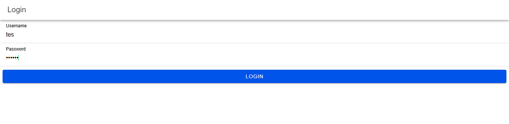
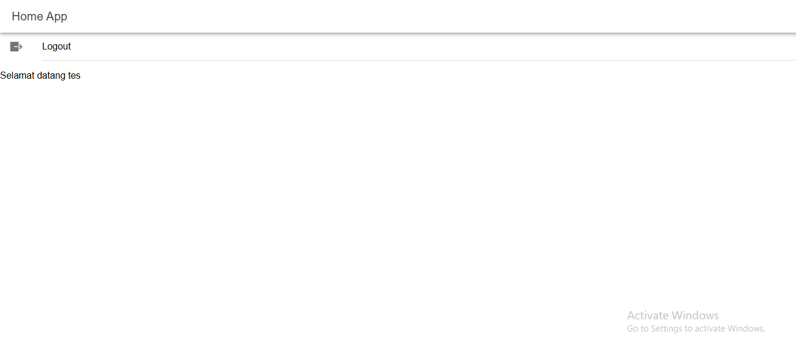
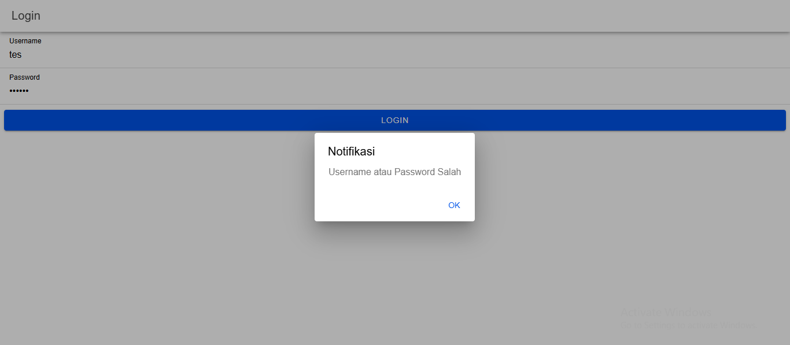

# coba-login
 Cara kerjanya:
1. Ketika aplikasi dibuka, user diarahkan ke halaman login
2. User memasukkan username dan password
3. Saat tombol login ditekan:
    - Sistem mengecek apakah username dan password sesuai
    
    - Jika sesuai, status login disimpan di localStorage dan user diarahkan ke home
    
    - Jika tidak sesuai, tampilkan pesan error
    
4. Cara kerja logout:
    - Saat tombol logout ditekan, fungsi logout() akan dijalankan
    - Status login dihapus dari localStorage dengan localStorage.removeItem()
    - User diarahkan kembali ke halaman login
    - Karena status login sudah dihapus, AuthGuard akan mencegah akses ke halaman home tanpa login ulang
